# Vilok

<picture>
  <source media="(prefers-color-scheme: dark)" srcset="./dark.svg">
  <source media="(prefers-color-scheme: light)" srcset="./light.svg">
  
</picture>

## About

Frontend Engineer focused on building responsive, production-oriented web applications with React.js, Next.js, and TypeScript. My work spans UI engineering, API integration, accessibility, performance, authentication, data, and AI-enabled product features.

The resume behind this profile lists two internships and a short production engagement at a US-backed SaaS company, plus three independently designed, built, and deployed full-stack applications. fileciteturn0file1L5-L9

## Engineering Focus

- React.js, Next.js 14/15 (App Router), TypeScript, JavaScript, HTML5, CSS3
- Tailwind CSS, Shadcn UI, Framer Motion, responsive/mobile-first UI, WCAG, ARIA, semantic HTML
- TanStack Query, Redux Toolkit, Zustand, Context API
- Node.js, REST APIs, Server Actions, MongoDB, PostgreSQL, Supabase, Zod, React Hook Form
- Clerk, NextAuth/Auth.js, OAuth 2.0, JWT, Vapi AI, Groq AI SDK, Replicate API
- Git, GitHub, Vercel, Netlify, Figma, Chrome DevTools, Lighthouse, cross-browser testing

These technologies and tools are listed in the supplied resume. fileciteturn0file1L10-L16

## Experience

### Junior Software Engineer — Synup
**Jan 2026 – Feb 2026 · US-backed SaaS Platform**

Onboarded into a production React + TypeScript codebase, worked through analytics frontend architecture and API integration flows, and participated in agile sprint and PR review processes. fileciteturn0file1L35-L41

### Frontend Developer Intern — Instinctive Studio
**2025 · Remote**

Built a student dashboard, multi-step authentication flow, and mobile-first search interface from Figma designs. Integrated REST APIs with TanStack Query and optimistic UI updates, with cross-browser delivery across Chrome, Firefox, Safari, and Edge. fileciteturn0file1L42-L47

### Frontend Developer Intern — Ocean Smart Solutions
**2024 · Remote**

Reduced page load time by 50% using React.lazy(), route-based chunking, and browser caching. Raised a Lighthouse accessibility score from 65 to 95 using semantic HTML5, ARIA, and WCAG 2.1 practices, and built a reusable Next.js component library. fileciteturn0file1L48-L52

## Featured Projects

### DevFlow — Full-Stack Developer Q&A Platform

Stack: Next.js, TypeScript, MongoDB, NextAuth, Tailwind CSS, Shadcn UI, Groq AI SDK.

A Stack Overflow-style Q&A platform with AI-generated answers, AI-assisted question enhancement, gamification, debounced global search, multiple Next.js rendering strategies, cache revalidation, and a markdown sanitization pipeline for malformed AI output. fileciteturn0file1L17-L23

### Dentwise — AI Dental Practice SaaS Platform

Stack: Next.js, TypeScript, PostgreSQL, Clerk, TanStack Query, Vapi AI, Stripe.

A multi-tenant dental SaaS with authentication, role-based access control, automated appointment booking, Stripe subscription billing, and a Vapi AI voice agent. The supplied resume reports 90+ Lighthouse performance via Vercel edge deployment. fileciteturn0file1L24-L29

### Lost & Found — Device Reporting & Recovery Platform

Stack: Next.js, TypeScript, MongoDB, Zustand, Framer Motion.

A device reporting and matching platform with debounced multi-criteria filtering, an admin moderation panel, global state via Zustand, and page transitions with Framer Motion. fileciteturn0file1L30-L34

## Education

**Bachelor of Computer Applications (BCA)** — KUD IBMR University, Karnataka  
CGPA: **8.0/10.0** · 2021–2023

**JavaScript Mastery Program** — Completed 2026 fileciteturn0file1L53-L55

## Connect

- [GitHub](https://github.com/VilokMasuti)
- Email: [vilokmasuti@outlook.com](mailto:vilokmasuti@outlook.com)

The supplied resume includes a LinkedIn label but does not provide the LinkedIn URL, so it is intentionally not linked here. fileciteturn0file1L3-L4
